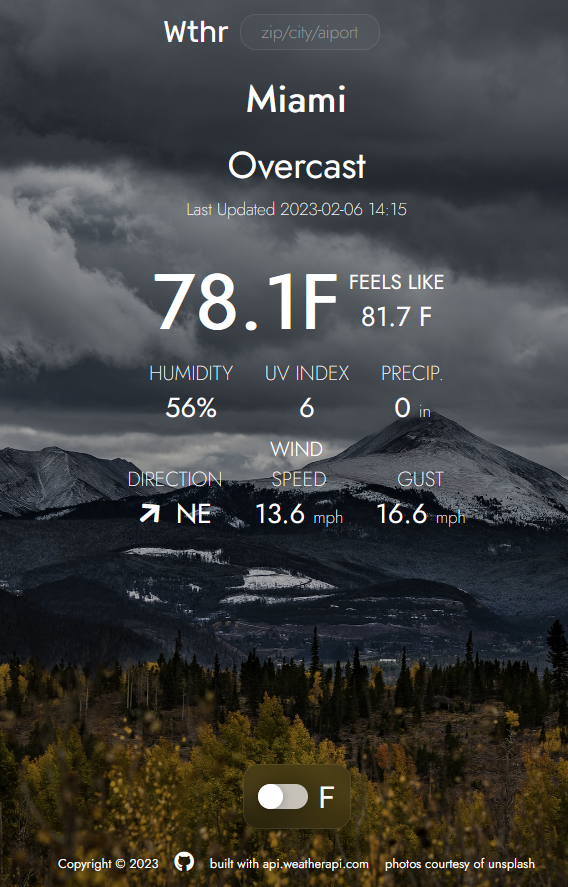

# Wthr

My minimalistic approach to a useful and stylish weather app. Written in vanilla Javascript.

If you find this app useful, or just like the design, consider giving this repo a star!

> \*\* I fully understand the API key is published in the code, and the implications of this. This is a free account with no payment information tied to it. If the key is compromised a new one will be generated if it becomes an issue. WeatherAPI free tier currently allows 1M requests/month and I don't expect to come close to that limit.

## Features

✔️ Automatically gets current weather based on IP address

✔️ Background image will reflect the current weather condition for a quick idea of the weather

✔️ Day/night images based on current time

✔️ Toggle between Farenheight and Celsius

✔️ Simple minimalist display

✔️ Responsive for mobile screens

✔️ Search by zip, city/state, airport code, ip-address, UK & Canada postal code, & more!

## How To Use

Visit the [Live Preview](https://nronzel.github.io/Wthr/) of the site, courtesy of Github Pages.

It should automatically get the weather for you based on IP address.

Use the search bar to search the weather for any location.

### Search:

The following parameters are allowed in the search box:

- Latitude and Longitude (Decimal degree) e.g: 48.8567,2.3508
- city name e.g.: Paris
- US zip e.g.: 10001
- UK postcode e.g: SW1
- Canada postal code e.g: G2J
- metar:<metar code> e.g: metar:EGLL
- iata:<3 digit airport code> e.g: iata:DXB
- IP address (IPv4 and IPv6 supported) e.g: 100.0.0.1

These parameters are directly from the WeatherApi documentation.

## Upcoming

- hourly forecast
- daily 3 day forecast
- more responsive for larger screens (I'd like the main data to spread out more on a larger screen)

## Notes From the Author

I made this app after initially making another app using openweathermap-api for the Odin Project. The original app was simple and I found it useful for getting the weather quickly before I go golfing, but the API felt cumbersome when I wanted to expand and add features.

With WeatherAPI I found it much easier to work with and gives me better data, so I re-wrote the app into what this is. I wanted something that had a dynamic background image that changed based on the weather and current time of day. As a golfer, the more granular wind data is important to me and I wanted to keep the UI clean and minimalist.

I plan on implementing tabs, one for daily (3 day) forecast, and one for hourly forecast for the next X hours (haven't decided how many yet, likely 24).

## Credits

https://www.weatherapi.com/ - API used for weather data. Very easy to use, provides a lot of data for the free tier, and caps out at 1M requests/month for free.

https://unsplash.com - images used for the background.
Federico Bottos
Roan Lavery
Eberhard Grossgasteiger
Paul Hanaoka
Gary Meulemans
