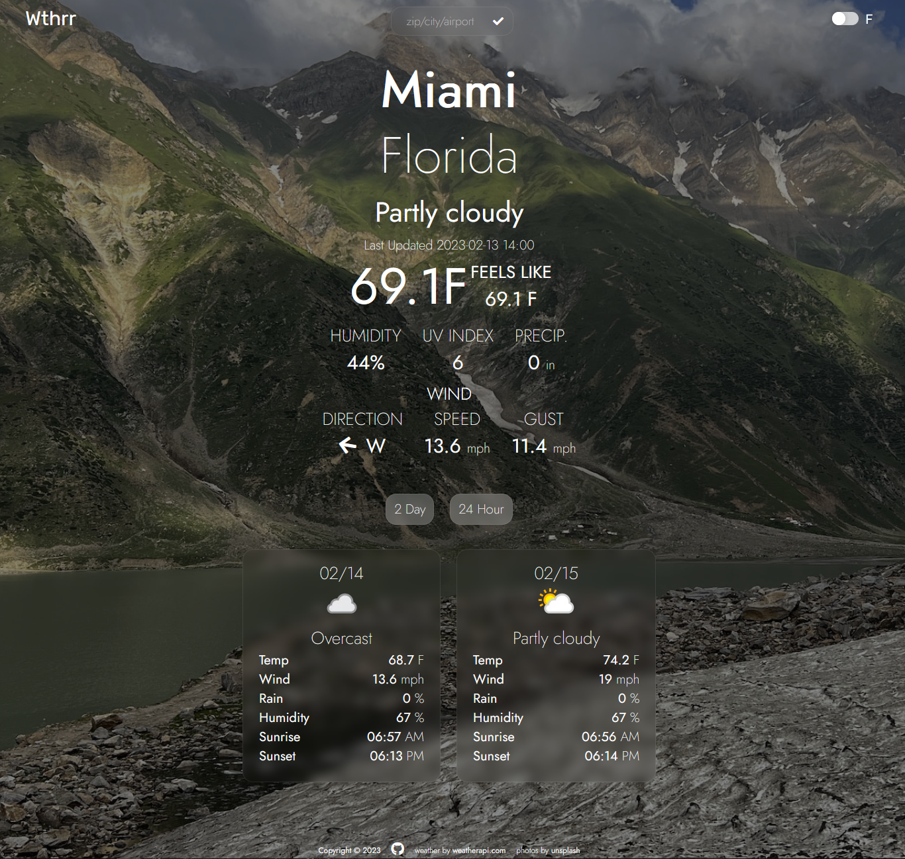

  

# Wthrr

## Description

My minimalistic approach to a useful and stylish weather app. Written in vanilla Javascript.

I made this app after making an initial app using openweathermap-api for the Odin Project. The original app was simple and I found it useful for getting the weather quickly before I go golfing, but the API felt cumbersome when I wanted to expand and add features.

After finding a new API (WeatherAPI) I decided to re-write the original app from scratch and make it something I would actually use.

My vision was a minimalist interface where the background image of the page reflects the current weather condition.

Re-writing and expanding this app was done more so I could get more experience. It also served as confirmation to myself that I can envision a project, plan it out, implement the plan, and see it through until I feel it is finished.

I fully understand the code is kind of a mess at the moment. I plan on cleaning it up over time as my skills improve.

Some things I learned from creating this project:

- How to use and manipulate data from an API.
- The importance of planning before writing code (the entire process goes much smoother if you think first, then write the code).
- Why a maintainable codebase is important and why you want your code as loosely coupled as possible. Going back to add features and realizing you need to modify more than one function or method when making a small change is never fun.
- Why `e.preventDefault()` is used and how it solved a bug I ran into that caused the first search term entered to return nothing.

> \* I fully understand the API key is published in the code, and the implications of this. This is a free account with no payment information tied to it. If the key is compromised a new one will be generated if it becomes an issue. WeatherAPI free tier currently allows 1M requests/month and I don't expect to come close to that limit.

If you find this app useful, or just like the design, consider giving this repo a star!

Thanks!

## Table of Contents

- [Features](#features)

- [Usage](#usage)

- [Upcoming](#upcoming)

- [Credits](#credits)

## Features

✔️ Automatically gets current weather based on IP address

✔️ Background image will reflect the current weather condition for a quick idea of the weather

✔️ Day/night images based on current time

✔️ Toggle between Farenheight and Celsius

✔️ Simple minimalist display

✔️ Responsive for mobile screens

✔️ Search by zip, city/state, airport code, ip-address, UK & Canada postal code, & more!

✔️ Show next 2 day daily forecast (WeatherAPI free tier limit)

✔️ Show the next 24 hours by the hour

## Usage

Visit the [Live Preview](https://nronzel.github.io/Wthr/) of the site, courtesy of Github Pages.

It should automatically get the weather for you based on IP address.

Use the search bar to search the weather for any location.

### Search:

The following parameters are allowed in the search box:

- Latitude and Longitude (Decimal degree) e.g: 48.8567,2.3508
- city name e.g.: Paris
- US zip e.g.: 10001
- UK postcode e.g: SW1
- Canada postal code e.g: G2J
- metar:<metar code> e.g: metar:EGLL
- iata:<3 digit airport code> e.g: iata:DXB
- IP address (IPv4 and IPv6 supported) e.g: 100.0.0.1

These parameters are directly from the WeatherApi documentation.

## Upcoming

- error tooltip if entered search term is invalid
- ~~hourly forecast~~ DONE!
- ~~daily 2 day forecast~~ DONE! (can only get 2 days into future, the 3 days included in free tier include today as day 0)
- more responsive for larger screens (I'd like the main data to spread out more on a larger screen)
- potentially search suggestion as the API allows it, haven't checked it out much yet but will look into implementing

## Credits

https://www.weatherapi.com/ - API used for weather data. Very easy to use, provides a lot of data for the free tier, and caps out at 1M requests/month for free.

https://unsplash.com - images used for the background.
Federico Bottos
Roan Lavery
Eberhard Grossgasteiger
Paul Hanaoka
Gary Meulemans
